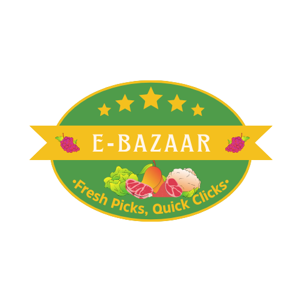

[![Contributors][contributors-shield]][contributors-url]
[![Forks][forks-shield]][forks-url]
[![Stargazers][stars-shield]][stars-url]
[![Issues][issues-shield]][issues-url]
[![LinkedIn][linkedin-shield]][linkedin-url]
<!-- [![MIT License][license-shield]][license-url] -->

<!-- PROJECT LOGO -->
 

  

<h3 align="center">EBazaar - Grocery Store Application</h3>

  

    The project is a multi-user grocery shopping app built with Flask for the API and VueJS for the UI, following RBAC for user roles. It allows user signup/login, admin login, and store manager signup/login. Admins manage categories, approving store manager requests. Store managers handle product management and category requests. Users can search, add products to a cart, and buy from multiple categories. The system includes backend jobs for exports, reports, and alerts, with performance optimization using caching. Scheduled jobs include daily reminders and monthly activity reports. Optional features include responsive UI, styling, discount functionality and filters/name search option.
     
     
    <a href="https://e-bazaar-jyst.onrender.com">View Demo</a>
    ·
    <a href="https://github.com/d-pamneja/Grocery_Store_Application_V2/issues">Report Bug</a>
    ·
    <a href="https://github.com/d-pamneja/Grocery_Store_Application_V2/issues">Request Feature</a>
  

<!-- TABLE OF CONTENTS -->

  
Table of Contents

  <ol>
    <li>
      <a href="#about-the-project">About The Project</a>
      <ul>
        <li><a href="#built-with">Built With</a></li>
      </ul>
    </li>
    <li>
      <a href="#getting-started">Getting Started</a>
      <ul>
        <li><a href="#prerequisites">Prerequisites</a></li>
        <li><a href="#installation">Installation</a></li>
      </ul>
    </li>
    <li><a href="#usage">Usage</a></li>
    <li><a href="#contributing">Contributing</a></li>
    <li><a href="#contact">Contact</a></li>
  </ol>

<!-- ABOUT THE PROJECT -->
## About The Project

[![Product Name Screen Shot][product-screenshot]](https://example.com)

Welcome to our grocery shopping application! This project is a feature-rich, multi-user platform designed for buying groceries seamlessly. It utilizes Flask for the API, VueJS for the user interface, and integrates RBAC (Role-Based Access Control) to manage different user roles, including admins and store managers.

## Key Features

- **User Management:** Secure user signup and login with token-based authentication for enhanced security.
- **Admin Control:** Exclusive admin access for managing categories, approving store manager requests, and overseeing the application.
- **Store Manager Tools:** Empower store managers with the ability to add, edit, and remove products, as well as request category modifications.
- **Efficient Shopping:** Intuitive shopping features, including a user-friendly cart system, product search, and the flexibility to buy from multiple categories.
- **Scheduled Jobs:** Automated daily reminders and monthly activity reports for user engagement and insights.
- **Backend Optimization:** Implementing caching for performance enhancement and backend jobs for exports, reports, and alerts.

(<a href="#readme-top">back to top</a>)

### Built With

* [![Vue][Vue.js]][Vue-url]
* [![Bootstrap][Bootstrap.com]][Bootstrap-url]

(<a href="#readme-top">back to top</a>)

<!-- GETTING STARTED -->
## Getting Started

This is an example of how you may give instructions on setting up your project locally.
To get a local copy up and running follow these simple example steps.

### Prerequisites

The complete WebApp runs only on Linux system. Please download the Mail Hog application (Fake SMTP server) for your system, not be linux version. One can run the full WebApp in WSL and run the MailHog server in Windows.

### Installation

Before we could use the web app, we need to setup the environment and servers for it.
1) <b>Setting up the Flask server :</b>   
   - In a new Linux terminal tab, start the Flask server by typing 

             python3 app.py

2) <b> Setting up Redis server : </b>    
    - In a new Linux terminal tab, start the redis server by typing 

          redis-server
    
3) <b> Setting up Celery Worker and Celery Beat : </b>
    - In a new Linux terminal tab, start the Celery Workers and Beat together by typing 
    
          Celery -A celery_task.celery worker -l info -B    
   

(<a href="#readme-top">back to top</a>)

<!-- USAGE EXAMPLES -->
## Usage

Below given are some additional screenshots of multiple pages of the application which can be accessed based on the basis of the level of control i.e. Admin, Store Manager or User.

1) <strong>Admin</strong>
    [![Product Admin Dashboard Screen Shot][product-admin-dashboard-screenshot]](https://example.com)
    - Above given is the admin dashboard, from where the admin can :
        - Perform the CRUD operations on the categories
        - Manage pending category requests made by the store managers
        - Select the preference of the monthly user report
        [![Product Admin Monthly Report Screen Shot][product-admin-monthly-report-screenshot]](https://example.com)
2) <strong>Store Manager</strong>
    [![Product Manager Dashboard Screen Shot][product-manager-dashboard-screenshot]](https://example.com)
    - Above given is the store manager dashboard, from where the managers can :
        - Perform the CRUD operations on the products
        - Creating and sending category requests to the admins
        - Generate the products csv and receive the same on registered mail
        [![Product CSV Report Screen Shot][product-csv-report-screenshot]](https://example.com)
3) <strong>User</strong>
    [![Product User Dashboard Screen Shot][product-user-dashboard-screenshot]](https://example.com)
    - Above given is the user dashboard, from where the user can :
        - Sort products based on filters and/or categories
        - Buy products from one and/or multiple categories
        - View cart and continue with completing the purchase
        - Viewing the order history

(<a href="#readme-top">back to top</a>)

<!-- CONTRIBUTING -->
## Contributing

I'm thrilled to have you exploring my project! This endeavor is a collective effort, and we believe that every contribution adds value and creativity to our community.

How You Can Contribute:

🛠️ Found a bug? Have an idea for improvement? Fork the repo and create a pull request.

💡 Have a suggestion for making this project even better? Open an issue with the "enhancement" tag.

⭐ Like what you see? Show your support by giving our project a star!

Remember, your contributions, whether big or small, are incredibly valuable to us. They help us learn, inspire, and create a better project together.

1. Fork the Project
2. Create your Feature Branch (`git checkout -b feature/AmazingFeature`)
3. Commit your Changes (`git commit -m 'Add some AmazingFeature'`)
4. Push to the Branch (`git push origin feature/AmazingFeature`)
5. Open a Pull Request

Thank you for being a part of this journey!

(<a href="#readme-top">back to top</a>)

<!-- CONTACT -->
## Contact

Dhruv Pamneja - dpamneja@gmail.com / 21f1001719@ds.study.iitm.ac.in

Project Link: [https://github.com/d-pamneja/Grocery_Store_Application_V2](https://github.com/d-pamneja/Grocery_Store_Application_V2)

(<a href="#readme-top">back to top</a>)

<!-- MARKDOWN LINKS & IMAGES -->
<!-- https://www.markdownguide.org/basic-syntax/#reference-style-links -->
[contributors-shield]: https://img.shields.io/github/contributors/d-pamneja/Grocery_Store_Application_V2.svg?style=for-the-badge
[contributors-url]: https://github.com/d-pamneja/Grocery_Store_Application_V2/graphs/contributors
[forks-shield]: https://img.shields.io/github/forks/d-pamneja/Grocery_Store_Application_V2.svg?style=for-the-badge
[forks-url]: https://github.com/d-pamneja/Grocery_Store_Application_V2/network/members
[stars-shield]: https://img.shields.io/github/stars/d-pamneja/Grocery_Store_Application_V2.svg?style=for-the-badge
[stars-url]: https://github.com/d-pamneja/Grocery_Store_Application_V2/stargazers
[issues-shield]: https://img.shields.io/github/issues/d-pamneja/Grocery_Store_Application_V2.svg?style=for-the-badge
[issues-url]: https://github.com/d-pamneja/Grocery_Store_Application_V2/issues
[license-shield]: https://img.shields.io/github/license/d-pamneja/Grocery_Store_Application_V2.svg?style=for-the-badge
[license-url]: https://github.com/d-pamneja/Grocery_Store_Application_V2/blob/master/LICENSE.txt
[linkedin-shield]: https://img.shields.io/badge/-LinkedIn-black.svg?style=for-the-badge&logo=linkedin&colorB=555
[linkedin-url]: https://www.linkedin.com/in/dhruv-pamneja-3b8432187/
[product-screenshot]: Images/Home_Page.png
[product-admin-dashboard-screenshot]: Images/ADMIN_DASHBOARD.png
[product-admin-monthly-report-screenshot]: Images/Monthly_Report.png
[product-csv-report-screenshot]: Images/CSV_Report.png
[product-manager-dashboard-screenshot]: Images/MANAGER_DASHBOARD.png
[product-user-dashboard-screenshot]: Images/USER_DASHBOARD.png
[Next.js]: https://img.shields.io/badge/next.js-000000?style=for-the-badge&logo=nextdotjs&logoColor=white
[Next-url]: https://nextjs.org/
[React.js]: https://img.shields.io/badge/React-20232A?style=for-the-badge&logo=react&logoColor=61DAFB
[React-url]: https://reactjs.org/
[Vue.js]: https://img.shields.io/badge/Vue.js-35495E?style=for-the-badge&logo=vuedotjs&logoColor=4FC08D
[Vue-url]: https://vuejs.org/
[Angular.io]: https://img.shields.io/badge/Angular-DD0031?style=for-the-badge&logo=angular&logoColor=white
[Angular-url]: https://angular.io/
[Svelte.dev]: https://img.shields.io/badge/Svelte-4A4A55?style=for-the-badge&logo=svelte&logoColor=FF3E00
[Svelte-url]: https://svelte.dev/
[Laravel.com]: https://img.shields.io/badge/Laravel-FF2D20?style=for-the-badge&logo=laravel&logoColor=white
[Laravel-url]: https://laravel.com
[Bootstrap.com]: https://img.shields.io/badge/Bootstrap-563D7C?style=for-the-badge&logo=bootstrap&logoColor=white
[Bootstrap-url]: https://getbootstrap.com
[JQuery.com]: https://img.shields.io/badge/jQuery-0769AD?style=for-the-badge&logo=jquery&logoColor=white
[JQuery-url]: https://jquery.com 
